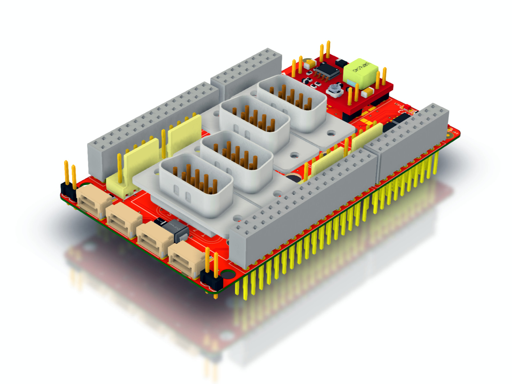
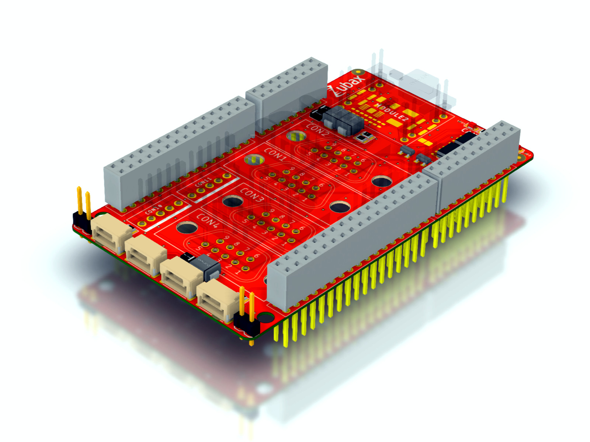
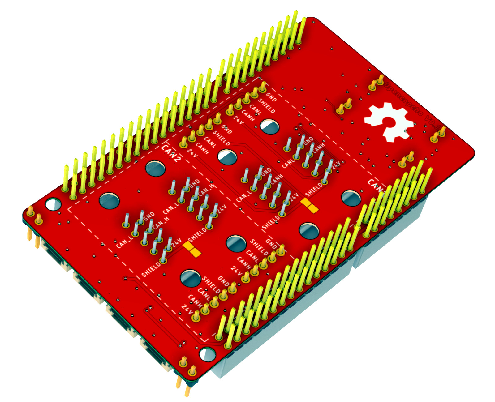

# Opencopcho

Open hardware shield for the [NUCLEO-H743ZI](https://www.st.com/en/evaluation-tools/nucleo-h743zi.html) board
for UAVCAN development.

Ask questions on the [UAVCAN forum](https://forum.uavcan.org) or [Zubax forum](https://forum.zubax.com).

Opencopcho is pronounced like [*open-cop-chow*](https://translate.google.com/#en/en/opencopcho).

## Design

The shield features two CAN FD interfaces with three pairs of standard UAVCAN-compatible connectors
(two connectors per interface).

The shield can be assembled in two configurations: **full** and **micro**.
The full configuration provides three types of connectors defined by the UAVCAN specification:

* UAVCAN Micro type (JST GH 4-pin)
* UAVCAN D-Subminiature (D-Sub DE9, de-facto industry-standard CAN connector)
* 2.54mm pin headers for connection to panel-mounted UAVCAN M8 connectors
(M8 5-pin B-coded connector, also used in CANopen)

The micro configuration has only the UAVCAN Micro connectors populated.
In this configuration, Opencopcho can be used with other shields stacked on top of it.

Full configuration:

Micro configuration:

Bottom view:

A 3D render is available here: <https://a360.co/2R1n94m>.

## License

This work is licensed under a
[Creative Commons Attribution 4.0 International License](http://creativecommons.org/licenses/by/4.0/).
